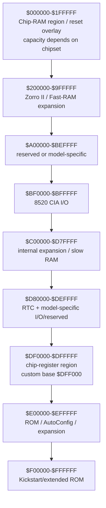
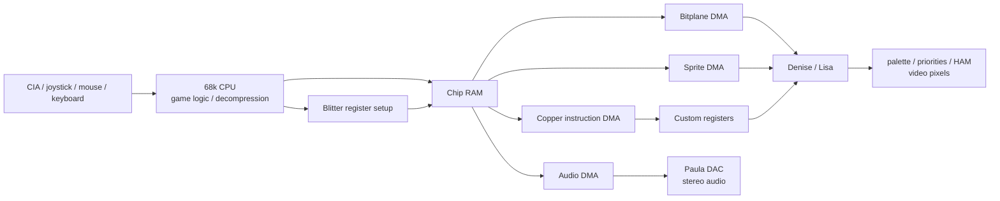
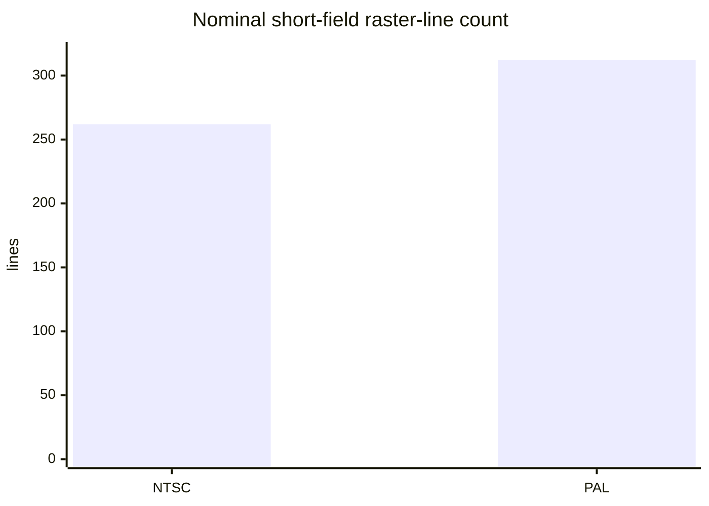

# AMIGA.md — Practical Guide for Reverse-Engineering Amiga Games

## Executive summary

This guide treats an Amiga game as a system of **Motorola 68k code, Chip RAM data structures and asynchronous custom-chip programs**, rather than as an ordinary linear executable. For reverse engineering, the most important architectural fact is that graphics, sprites, Copper instructions, blitter operands, disk DMA and Paula audio are driven through memory-mapped hardware centred on `$DFF000`, while the custom chips obtain their DMA-visible data from **Chip RAM**. Commodore explicitly states that Copper instruction fetches come from Chip RAM and that bitplanes, sprites, Copper lists and audio data may be placed anywhere within the Chip RAM supported by the installed Agnus/Alice. citeturn12view2turn15view3

The most productive investigation strategy is therefore usually:

**input register → game state → frame/update loop → rendering commands → Copper/blitter state → bitplane pointers → graphics/resource data**, rather than trying to understand the complete program from its entry point downwards.

For an unknown title, assume initially that it targets a **68000, PAL-capable OCS/ECS machine with 512 KiB–1 MiB of Chip RAM**, while treating every one of those assumptions as provisional. Detect AGA explicitly rather than assuming it from the binary. An A1200 instead has a 68EC020, the AA/AGA Alice/Lisa chipset, 2 MiB of Chip RAM in the standard machine, eight bitplanes and a 256-entry 24-bit palette architecture. Commodore's A1200 functional specification identifies AA—subsequently called AGA—and gives the PAL/NTSC CPU clocks as approximately 14.18/14.32 MHz. citeturn14view0

The hardware division relevant to an agent is:

| Component | Reverse-engineering significance |
|---|---|
| **68000 / 68020-family CPU** | Runs game logic, decompressors, loaders and often constructs or patches Copper/blitter command data. |
| **Agnus / Alice** | Chip-RAM DMA arbitration, Copper, blitter, bitplane/sprite DMA address generation and display timing. |
| **Denise / Lisa** | Converts planar bitplanes and sprites into pixels; handles palette, display modes and collision logic. |
| **Paula** | Four-channel PCM audio, disk data path, serial and interrupt-related functions. |
| **8520 CIAs** | Keyboard serial interface, fire buttons, timers, floppy controls and other low-speed I/O. |
| **Gary / Gayle / related glue logic** | Address decoding and motherboard bus/control functions; not the graphics/audio “custom chipset” itself. Gary is characteristic of machines such as the A500/A2000; A600/A1200 use Gayle, and the A1200 additionally uses Budgie for parts of the CPU/chip-memory interface. citeturn20search0turn14view0 |

The original Commodore Hardware Reference Manual is the baseline authority for OCS/ECS behaviour; the A1200/AA specifications are required for AGA-specific interpretation. The HRM also warns that AmigaOS does **not** impose a fixed application RAM layout: software is intended to be relocatable, and the only fixed system pointer application code traditionally relies on is the `exec.library` base pointer at absolute address `$00000004`. citeturn12view2

**Assumptions where the target is unspecified**

| Question | Working assumption | Change it when… |
|---|---|---|
| Machine | A500-class OCS/ECS | AGA registers, 68020 code, 2 MiB Chip RAM or A1200 hardware appears. |
| CPU | MC68000 | 68020+ instructions, VBR use, A1200 metadata or machine-specific code appears. |
| Video | PAL first, but dual-check NTSC | Display/raster constants or game build indicate NTSC. |
| OS | Unknown; may boot under AmigaOS and later take over | Exec/DOS calls continue through game play, or conversely direct hardware takeover appears. |
| Binary | Big-endian 68k data | Container/decompressor proves otherwise. |
| Graphics | Native planar bitplanes | Runtime chunky-to-planar conversion is observed. |
| Disk/file resources | Possibly custom-packed | Valid IFF/Hunk/module headers establish standard formats. |
| Hardware registers | OCS-compatible subset unless detected | ECS/AGA-only registers are touched. |

## Architecture, chipset generations, memory map and registers

The original Amiga architecture combines a 68k processor with three principal multimedia custom chips: Agnus, Denise and Paula. The A500/A2000-era 68000 operates at approximately 7.16 MHz NTSC or 7.09 MHz PAL; custom-chip DMA shares Chip RAM with the CPU. Later ECS Agnus variants expanded DMA-addressable Chip RAM to 1 or 2 MiB depending on model, while AGA replaced Agnus/Denise with Alice/Lisa and widened the graphics subsystem. citeturn15view0turn15view1turn15view3

### Chipset comparison

| Feature | OCS | ECS | AGA / AA, notably A1200 |
|---|---|---|---|
| DMA/address-generation chip | Agnus / Fat Agnus | Enhanced Agnus | **Alice** |
| Display chip | Denise | Enhanced/Super Denise | **Lisa** |
| Audio/disk chip | Paula | Paula | Paula |
| Typical CPU | 68000 | 68000; A3000 differs | A1200: 68EC020 |
| Maximum practical Chip RAM addressability | Original chipset principally 512 KiB | Up to 1 or 2 MiB depending Agnus/model | A1200: 2 MiB |
| Native bitplanes | Up to 6 | Up to 6 | Up to 8 |
| Palette architecture | 32 × 12-bit RGB registers | 32 × 12-bit RGB | 256 entries, 24-bit RGB |
| HAM | HAM6 | HAM6 | HAM6 + HAM8 |
| Extra resolution | LoRes, HiRes | Adds SuperHires and programmable timing facilities | AGA bandwidth supports deeper high-resolution displays |
| Blitter | Classic size registers | “Big blit” extension, up to 32K-scale dimensions | ECS-compatible big blits |
| Palette banking | No | No | Yes; 32 `COLORxx` write ports select banks through `BPLCON3` |
| Wider sprite fetch | No | No | AGA fetch modes allow wider sprite data |
| Key extra registers | — | `DENISEID`, `BPLCON3`, beam/timing registers, `BLTSIZV/H` | `BPLCON4`, `CLXCON2`, `FMODE`, AGA extensions |

The ECS Hardware Reference Manual documents programmable scan timing, SuperHires, enhanced Denise identification and the expanded blitter range; Commodore's A1200 specification documents eight bitplanes and 256 simultaneous palette entries selected from a 24-bit RGB space for AA/AGA. citeturn15view3turn14view0

A useful warning for automated analysis is that **“ECS” is not one immutable RAM configuration**. Commodore describes Fat Agnus configurations with 512 KiB DMA reach, ECS machines with 1 MiB Chip RAM and systems such as the A3000 with 2 MiB Chip RAM. Infer the actual limit from the machine, Agnus revision or observed DMA pointers rather than the game's marketing date. citeturn15view3

### Classic 24-bit address space

The following is the practical OCS/ECS-oriented CPU map. The HRM itself warns that this is a **hardware address-space map, not a promise about where an operating-system application will be loaded**. citeturn10search10turn12view2

| CPU addresses | Size | Principal use |
|---|---:|---|
| `$000000–$03FFFF` | 256 KiB | First Chip RAM quarter; ROM overlay may be present during reset. |
| `$040000–$07FFFF` | 256 KiB | Remaining original 512 KiB Chip RAM. |
| `$080000–$0FFFFF` | 512 KiB | Chip-RAM extension on suitable Agnus configurations. |
| `$100000–$1FFFFF` | 1 MiB | Further Chip-RAM extension to 2 MiB on supporting ECS/AGA systems. |
| `$200000–$9FFFFF` | 8 MiB | Primary Zorro II / AutoConfig expansion area; commonly Fast RAM. |
| `$A00000–$BEFFFF` | 1,984 KiB | Reserved/model-specific on classic systems; later machines repurpose portions. |
| `$BF0000–$BFFFFF` | 64 KiB | CIA decode region. CIA-B is centred on `$BFDxxx`; CIA-A on `$BFExxx`. |
| `$C00000–$D7FFFF` | 1.5 MiB | Internal expansion area; the familiar `$C00000` “slow”/Ranger RAM appears here on applicable A500 configurations. |
| `$D80000–$DBFFFF` | 256 KiB | Reserved/model-specific. |
| `$DC0000–$DCFFFF` | 64 KiB | Real-time clock region where fitted. |
| `$DD0000–$DFEFFF` | 188 KiB | Reserved/model-specific I/O space. |
| `$DFF000–$DFFFFF` | 4 KiB | Custom-chip register decode window; useful registers occupy the low offsets from `$DFF000`. |
| `$E00000–$E7FFFF` | 512 KiB | Reserved/extended-ROM use varies by machine. |
| `$E80000–$E8FFFF` | 64 KiB | Zorro AutoConfig space. |
| `$E90000–$EFFFFF` | 448 KiB | Secondary expansion/configuration space. |
| `$F00000–$FBFFFF` | 768 KiB | ROM/extended-ROM area whose use changes between machines and Kickstart generations. |
| `$FC0000–$FFFFFF` | 256 KiB | Classic 256 KiB Kickstart ROM window; later 512 KiB ROM arrangements extend lower. |

The most important distinction for reverse engineering is **Chip RAM versus CPU-only/Fast RAM**, not merely the numerical range. Agnus/Alice DMA engines cannot blindly consume arbitrary Fast RAM pointers. A pointer used by bitplane, sprite, audio, Copper or blitter DMA is therefore an exceptionally strong clue that the pointed-to buffer must reside in DMA-accessible Chip RAM. citeturn15view3



### A1200-specific map

Do **not** apply the classic `$A00000–$BEFFFF` interpretation blindly to an A1200. Commodore's 1992 functional specification assigns large portions to the PC Card/PCMCIA interface, IDE and other system logic. citeturn17view7

| A1200 address | Size | Assignment in Commodore specification |
|---|---:|---|
| `$000000–$1FFFFF` | 2 MiB | Chip RAM / reset ROM overlay |
| `$200000–$5FFFFF` | 4 MiB | Zorro II expansion |
| `$600000–$9FFFFF` | 4 MiB | PC Card common memory |
| `$A00000–$A1FFFF` | 128 KiB | PC Card attribute |
| `$A20000–$A3FFFF` | 128 KiB | PC Card I/O |
| `$A40000–$A5FFFF` | 128 KiB | PC Card / CDTV-like bits |
| `$A60000–$A7FFFF` | 128 KiB | PC I/O |
| `$A80000–$B7FFFF` | 1 MiB | System-ROM-selected region |
| `$B80000–$BEFFFF` | 448 KiB | Reserved |
| `$BF0000–$BFFFFF` | 64 KiB | 8520 CIAs |
| `$C00000–$CFFFFF` | 1 MiB | C00000 memory |
| `$D00000–$D7FFFF` | 512 KiB | PC memory |
| `$D80000–$D8FFFF` | 64 KiB | Spare chip select |
| `$D90000–$D9FFFF` | 64 KiB | ARCNET chip select |
| `$DA0000–$DA3FFF` | 16 KiB | IDE |
| `$DA4000–$DA4FFF` | 4 KiB address interval | IDE-reserved interval; the surviving textual spec labels this “16 KB”, which conflicts with the address bounds. |
| `$DA8000–$DAFFFF` | 32 KiB | PC Card + IDE configuration |
| `$DB0000–$DBFFFF` | 64 KiB | Reserved external IDE |
| `$DC0000–$DCFFFF` | 64 KiB | RTC |
| `$DD0000–$DDFFFF` | 64 KiB | Reserved DMA-controller space |
| `$DE0000–$DEFFFF` | 64 KiB | Unused |
| `$DF0000–$DFFFFF` | 64 KiB | Chip-register decode region |
| `$E00000–$E7FFFF` | 512 KiB | First half of 1 MiB system ROM when applicable |
| `$E80000–$EFFFFF` | 512 KiB | Configuration / I/O-card space |
| `$F00000–$F7FFFF` | 512 KiB | Flash-ROM space |
| `$F80000–$FFFFFF` | 512 KiB | System ROM / second half of 1 MiB ROM |

The final `$F80000–$FFFFFF` endpoint above is reconstructed from the specified 512 KiB region; the OCR copy of Commodore's document truncates one hexadecimal digit in that endpoint. citeturn17view7

### Custom-register map

The canonical base is:

```text
CUSTOM = $DFF000
absolute_address = $DFF000 + register_offset
```

Commodore's own hardware include files define `CUSTOM equ $DFF000`. citeturn17view6

The following table is intentionally arranged for reverse engineering rather than programming: a write cluster to one row should be classified as a subsystem immediately.

| Offset | Register(s) | R/W | Meaning / RE clue |
|---:|---|:---:|---|
| `$000` | `BLTDDAT` | R | Blitter destination early read/dummy. |
| `$002` | `DMACONR` | R | DMA status; includes blitter busy/zero state. |
| `$004` | `VPOSR` | R | High vertical beam/field/chip-identification information. |
| `$006` | `VHPOSR` | R | Vertical/horizontal beam position; tight reads imply raster synchronisation. |
| `$008` | `DSKDATR` | R | Disk data. |
| `$00A,$00C` | `JOY0DAT`,`JOY1DAT` | R | Mouse counters / digital joystick direction inputs. |
| `$00E` | `CLXDAT` | R | Sprite/playfield collision latch; read clears it. |
| `$010` | `ADKCONR` | R | Audio/disk control status. |
| `$012,$014` | `POT0DAT`,`POT1DAT` | R | Pot/mouse-button-related counters. |
| `$016` | `POTINP` | R | Pot input state. |
| `$018` | `SERDATR` | R | Serial data/status. |
| `$01A` | `DSKBYTR` | R | Disk byte/status. |
| `$01C` | `INTENAR` | R | Interrupt-enable state. |
| `$01E` | `INTREQR` | R | Pending interrupt requests. |
| `$020–$026` | `DSKPT*`,`DSKLEN`,`DSKDAT` | R/W | Disk DMA pointer, length/control and data. |
| `$02A,$02C` | `VPOSW`,`VHPOSW` | W | Beam-position/control writes. |
| `$02E` | `COPCON` | W | Copper access control / danger bit. |
| `$030,$032` | `SERDAT`,`SERPER` | W | Serial transmit + period. |
| `$034` | `POTGO` | W | Pot-line control/start. |
| `$036` | `JOYTEST` | W | Joystick/mouse counter test/write. |
| `$038–$03E` | `STREQU`,`STRVBL`,`STRHOR`,`STRLONG` | W | Beam/synchronisation strobes. |
| `$040,$042` | `BLTCON0`,`BLTCON1` | W | Blitter source enables, shifts, minterm, line/fill/direction controls. |
| `$044,$046` | `BLTAFWM`,`BLTALWM` | W | First/last A-word masks. |
| `$048–$056` | `BLTCPT*`,`BLTBPT*`,`BLTAPT*`,`BLTDPT*` | W | Blitter C/B/A source and D destination pointers. |
| `$058` | `BLTSIZE` | W | Legacy blit width/height **and start trigger**. |
| `$05A–$05E` | `BLTCON0L`,`BLTSIZV`,`BLTSIZH` | W | ECS extended/blig-blit controls; `BLTSIZH` starts extended blit. |
| `$060–$066` | `BLTCMOD`,`BLTBMOD`,`BLTAMOD`,`BLTDMOD` | W | Per-line pointer increments beyond transferred words. |
| `$070–$074` | `BLTCDAT`,`BLTBDAT`,`BLTADAT` | W | Constant/preloaded source words. |
| `$07C` | `DENISEID` | R | Enhanced Denise identification. |
| `$07E` | `DSKSYNC` | W | Disk synchronisation word. |
| `$080–$086` | `COP1LC*`,`COP2LC*` | W | Copper-list pointers. **Prime discovery target.** |
| `$088,$08A` | `COPJMP1`,`COPJMP2` | W | Copper restart/strobe. |
| `$08C` | `COPINS` | W | Copper instruction register/internal use. |
| `$08E,$090` | `DIWSTRT`,`DIWSTOP` | W | Display-window vertical/horizontal bounds. |
| `$092,$094` | `DDFSTRT`,`DDFSTOP` | W | Bitplane DMA fetch window. |
| `$096` | `DMACON` | W | Set/clear DMA enables. |
| `$098` | `CLXCON` | W | Collision comparator/control. |
| `$09A,$09C` | `INTENA`,`INTREQ` | W | Interrupt enable/request set-clear registers. |
| `$09E` | `ADKCON` | W | Audio/disk control. |
| `$0A0–$0DA` | `AUD0*–AUD3*` | R/W | Four Paula channels: location, length, period, volume, data. |
| `$0E0–$0FE` | `BPL1PT*–BPL8PT*` | W | Bitplane DMA pointers; 7–8 are AGA territory. |
| `$100` | `BPLCON0` | W | Plane count, resolution, HAM, dual-playfield, interlace etc. |
| `$102` | `BPLCON1` | W | Horizontal fine scroll. |
| `$104` | `BPLCON2` | W | Playfield/sprite priorities. |
| `$106` | `BPLCON3` | W | ECS/AGA enhanced control; AGA palette bank/precision operations. |
| `$108,$10A` | `BPL1MOD`,`BPL2MOD` | W | Odd/even-plane per-line modulo. |
| `$10C` | `BPLCON4` | W | AGA bitplane/sprite colour-selection extensions. |
| `$10E` | `CLXCON2` | W | AGA collision extension. |
| `$110–$11E` | `BPL1DAT–BPL8DAT` | W | Direct bitplane data paths. |
| `$120–$13E` | `SPR0PT*–SPR7PT*` | W | Eight sprite DMA pointers. |
| `$140–$17E` | `SPRxPOS/CTL/DATA/DATB` | W | Sprite position/control/pixel data. |
| `$180–$1BE` | `COLOR00–COLOR31` | W | Palette write window. OCS/ECS = 12-bit colour; AGA banks it into 256 entries. |
| `$1C0–$1E4` | timing registers | R/W | ECS programmable horizontal/vertical totals, blanking/sync, beam control, `DIWHIGH`. |
| `$1FC` | `FMODE` | W | AGA bitplane/sprite fetch mode. |

The HRM register summaries and Commodore Denise specification confirm the bitplane-data/control and 32-colour-register organisation; Denise contains six bitplane and eight sprite-pair serial paths and converts the selected colour through 12-bit RGB on OCS/ECS. citeturn4view0turn4view1turn4view2turn18view4

Two register behaviours deserve to become hard-coded agent rules:

1. **`DMACON`, `INTENA`, `INTREQ` and `ADKCON` use set/clear semantics.** Bit 15 determines whether the asserted lower bits are set or cleared; writing zero bits does not clear corresponding state. citeturn17view2
2. Many custom registers are **write-only or have different read and write functions at nearby/same logical locations**. A naïve memory model that assumes ordinary RAM semantics will produce false dataflow.

## Graphics architecture, blitter and Copper

### Planar graphics

Native Amiga graphics are planar. For `P` bitplanes, the colour index of pixel `x` is assembled from one bit at the same pixel position in each plane:

```text
plane 0 bit ───────┐
plane 1 bit ─────┐ │
plane 2 bit ───┐ │ │
               v v v
colour index = b0 + 2*b1 + 4*b2 + ...
```

Within bitplane words, pixels are emitted **most-significant bit first**. Commodore's Denise specification describes the `BPLxDAT` serialisation and the bitplane-control registers controlling these paths. citeturn3view3turn4view0

Thus an uncompressed 320-pixel-wide plane normally has:

```text
320 / 8 = 40 bytes per row
40 * 256 = 10,240 bytes per 256-line plane

5 planes:
10,240 * 5 = 51,200 bytes
```

At 320×200, the analogous total for one plane is 8,000 bytes. These arithmetic sizes are useful **signatures**, not file-format guarantees: resources may be cropped, interleaved by scanline, compressed or stored as tiles.

The display dataflow is:



**Contiguous planes** commonly have one pointer per entire plane and `BPL1MOD/BPL2MOD` near zero for a straightforward full-width bitmap. **Scanline-interleaved planes** place plane 0 row 0, plane 1 row 0, … then row 1; their bitplane pointers start a row-stride apart and the modulo skips the other planes between successive fetches. This relationship is often more reliable than trying to recognise raw artwork visually.

`BPLCON0` identifies the number of active planes and major modes; `DIWSTRT/DIWSTOP` determine the display window while `DDFSTRT/DDFSTOP` govern the DMA fetch interval. `BPL1MOD/BPL2MOD` then tell you how much address adjustment is applied after each raster row. citeturn18view7turn16view5

In **dual-playfield mode**, odd and even planes form separate playfields with independently controlled scrolling and priority. A characteristic game engine therefore has two pointer/modulo groups and may use one playfield as foreground objects or parallax scenery while the other forms the background. The hardware priority/collision stage combines playfields and sprites after their bit streams have been generated. citeturn17view3

### Palette and sprites

OCS/ECS expose 32 colour registers at `$DFF180–$DFF1BE`, each conventionally interpreted as:

```text
word: 0000 RRRR GGGG BBBB
```

giving four bits per component. Denise uses the five-bit colour selection to choose one of these 32 registers. citeturn3view3turn4view2

AGA preserves the 32-register programming window for compatibility but expands the logical palette to **256 24-bit entries**. `BPLCON3` selects a 32-colour bank and whether a write supplies the high or low nibbles of the RGB components. Therefore a repeated pattern of:

```text
write BPLCON3
write COLOR00..COLOR31
change BPLCON3
write COLOR00..COLOR31
```

is a strong AGA signature. Commodore's A1200 specification describes the expanded 256-entry palette and 24-bit colour space. citeturn14view0

The hardware provides eight sprite channels. On OCS/ECS a normal sprite is 16 pixels wide and contributes two bits per pixel; pairing/attaching neighbouring sprite channels permits a combined four-bit sprite. Position/control words precede sprite scanline data. For reverse engineering, writes to `$DFF120–$DFF13E` identify sprite-list pointers, while Copper writes into sprite pointer or position registers often reveal **sprite multiplexing**. citeturn3view3turn19search8

### Blitter model

The blitter is easiest to model as:

```text
A ── mask ── shift ─┐
B ─────────── shift ─┼── 8-bit Boolean minterm ── optional fill ──> D
C ──────────────────┘
```

A, B and C are logical sources; D is the destination. Any memory channel can be disabled while its internal data register continues to participate in the Boolean operation. `BLTCON0` selects source/D enables and the 8-bit Boolean function; `BLTCON1` supplies B shift plus direction/line/fill controls. Commodore explicitly gives the classic masked “cookie-cut” expression as `AB + A̅C`, minterm `$CA`: where the A mask is set, copy B; otherwise retain C. citeturn18view5turn18view6

Typical minterms worth recognising are:

| Function | Minterm | Interpretation |
|---|---:|---|
| Clear | `$00` | `D = 0` |
| C only | `$AA` | `D = C` |
| B only | `$CC` | `D = B` |
| A only | `$F0` | `D = A` |
| Set | `$FF` | `D = 1` |
| Cookie cut | `$CA` | `D = A ? B : C` |

For legacy area blits, `BLTSIZE` encodes height in bits 15–6 and width in 16-bit words in bits 5–0. Writing `BLTSIZE` starts the operation. ECS introduces `BLTSIZV/BLTSIZH` for much larger dimensions; the HRM describes the enhanced “big blit” range as reaching roughly 32K × 32K pixels. citeturn16view2turn15view3

A representative masked BOB sequence looks like this:

```asm
        lea     $00dff000,a6

.wait:  btst    #6,2(a6)            ; DMACONR high byte: BBUSY
        bne.s   .wait

        move.w  #$0fca,$40(a6)      ; BLTCON0:
                                        ; A+B+C+D enabled
                                        ; Boolean function = $CA cookie cut
        clr.w   $42(a6)             ; BLTCON1: ascending, no B shift

        move.w  #$ffff,$44(a6)      ; BLTAFWM
        move.w  #$ffff,$46(a6)      ; BLTALWM

        move.l  a_mask,$50(a6)      ; BLTAPT
        move.l  bob_image,$4c(a6)   ; BLTBPT
        move.l  screen_src,$48(a6)  ; BLTCPT
        move.l  screen_dst,$54(a6)  ; BLTDPT

        move.w  src_mod,$64(a6)     ; BLTAMOD
        move.w  src_mod,$62(a6)     ; BLTBMOD
        move.w  dst_mod,$60(a6)     ; BLTCMOD
        move.w  dst_mod,$66(a6)     ; BLTDMOD

        move.w  #((HEIGHT<<6)|WORDS),$58(a6)
                                        ; BLTSIZE write launches blit
```

This is illustrative rather than a universal calling convention. In a real binary, expect compiler/assembler variations, precomputed control words, pointer writes in another order and overlapping CPU work after launch. The important fingerprint is a **cluster of writes into `$40–$76` terminating in `$58` or ECS `$5E`**.

Common game uses are:

| Register pattern | Likely operation |
|---|---|
| A/B/C/D + minterm `$CA` | Masked BOB/object draw |
| One source + D, `$F0`/`$CC` | Bitmap copy |
| D + zero minterm | Rectangle/plane clear |
| Negative/descending setup | Overlapping scroll/memmove |
| `BLTCON1` line-mode bit | Vector/line drawing |
| Fill controls | Polygon/area fill |
| Many small same-sized operations | Tile rendering, glyphs or BOBs |

Blits are **asynchronous**. A CPU routine may launch a blit and continue; the actual dependency often appears at the next `BBUSY` wait or `BLIT` interrupt rather than directly after `BLTSIZE`.

### Copper instruction set

The Copper executes from Chip RAM and has precisely three instruction classes: **MOVE, WAIT and SKIP**. citeturn12view2

**MOVE**

```text
word 0: register offset, bit 0 = 0
word 1: 16-bit value

example:
$0180,$0F00    ; COLOR00 := red
```

**WAIT**

```text
word 0:
15........8  7........1 0
vertical VP   horizontal HP 1

word 1:
comparison masks plus blitter-condition control
bit 0 = 0
```

A WAIT suspends Copper execution until the masked beam position is equal to or beyond the target. While waiting, the Copper does not consume memory cycles. citeturn17view0

**SKIP** has the same positional representation, but bit 0 of its second word is `1`; if the beam has reached/passed the requested position, the **next Copper instruction is skipped**. citeturn16view1

The canonical end marker is:

```text
$FFFF,$FFFE
```

which Commodore's include file names `COPPER_HALT`. citeturn17view6

An extremely common raster-effect list is therefore:

```asm
CopperList:
        dc.w    $2c01,$fffe          ; WAIT: raster line $2c
        dc.w    $0180,$0000          ; MOVE COLOR00 = black

        dc.w    $6401,$fffe          ; WAIT: line $64
        dc.w    $0180,$000f          ; COLOR00 = blue

        dc.w    $9601,$fffe          ; WAIT: line $96
        dc.w    $0180,$00f0          ; COLOR00 = green

        dc.w    $c801,$fffe          ; WAIT: line $c8
        dc.w    $0180,$0f00          ; COLOR00 = red

        dc.w    $ffff,$fffe          ; HALT forever
```

At binary level this becomes an attractive signature because alternating big-endian words resemble:

```text
2C 01 FF FE 01 80 00 00
64 01 FF FE 01 80 00 0F
96 01 FF FE 01 80 00 F0
C8 01 FF FE 01 80 0F 00
FF FF FF FE
```

A split-screen can change bitplane pointers while the beam is in flight:

```asm
        ; First portion already uses its original BPL1 pointer.

        dc.w    $8001,$fffe          ; wait near line 128

        dc.w    $00e0,$0002          ; BPL1PTH
        dc.w    $00e2,$0000          ; BPL1PTL
                                        ; BPL1 now points at $00020000

        dc.w    $0180,$000f          ; optionally change background
        dc.w    $ffff,$fffe
```

The CPU-side setup typically looks like:

```asm
        lea     $00dff000,a6

        move.l  #CopperList,$80(a6)  ; COP1LCH/L
        move.w  #0,$88(a6)           ; COPJMP1: reload/restart

        move.w  #$8380,$96(a6)       ; SETCLR
                                        ; DMAEN + BPLEN + COPEN
```

This fragment is diagnostically important. In disassembly, the sequence

```text
write long pointer at CUSTOM+$80
write anything to CUSTOM+$88
set COPEN in DMACON
```

almost certainly reveals a Copper-list root.

Horizontal “sine” distortions typically consist of one WAIT per scanline or small group of lines followed by writes to `BPLCON1`:

```asm
        dc.w $5001,$fffe, $0102,$0011
        dc.w $5101,$fffe, $0102,$0022
        dc.w $5201,$fffe, $0102,$0033
        dc.w $5301,$fffe, $0102,$0044
```

A program may regenerate only the `$0011,$0022,…` words each frame from a sine table. This is why a data watchpoint on the Copper list can lead directly to the game's effect-generation routine. Practical community demonstrations show the same technique for per-raster horizontal sinusoidal shifts. citeturn22search24

Other Copper patterns to recognise are:

| Copper target | Likely effect |
|---|---|
| `COLORxx` | Raster bars, gradients, sky colours, palette splits |
| `BPLxPT*` | Split screens, double buffering, vertical scrolling |
| `BPLCON1` | Fine scrolling / sine distortion |
| `BPLCON0` | Mid-frame mode/depth changes |
| `BPL1MOD/BPL2MOD` | Perspective/line stride tricks |
| `SPRxPT*`, `SPRxPOS/CTL` | Sprite multiplexing |
| `INTREQ` | Copper-generated CPU event |
| Blitter registers | Copper-triggered blits; restricted by `COPCON` semantics |

`COPCON` controls dangerous access to lower custom registers. Treat Copper MOVEs below the usual display register range as noteworthy: they may be manipulating the blitter or other sensitive hardware and behaviour differs subtly across chipset revisions. Commodore specifically documents the expanded ECS interpretation of the `CDANG` facility. citeturn16view0

## Display timing, DMA, interrupts, audio and input

### PAL and NTSC raster timing

The Copper's vertical compare contains only eight vertical-position bits even though a complete Amiga field exceeds 256 lines. The HRM gives **262 possible NTSC positions and 312 PAL positions** in the ordinary field and describes interlaced fields alternating 262/263 NTSC or 312/313 PAL. It also gives approximately 227 colour-clock positions per PAL line, with NTSC alternating 227- and 228-clock lines. citeturn17view1



This is why a naïve Copper parser that assumes an eight-bit vertical value is the complete screen coordinate fails after line 255. Copper lists can deliberately cross the apparent eight-bit wrap and continue into the remaining lines. citeturn17view1

Nominal Commodore display-window values include:

| Register field | NTSC nominal | PAL nominal |
|---|---:|---:|
| `DIWSTRT.VSTART` | `$2C` | `$2C` |
| `DIWSTRT.HSTART` | `$81` | `$81` |
| `DIWSTOP.VSTOP` | `$F4` | `$2C` interpreted as `$12C` |
| `DIWSTOP.HSTOP` | `$C1` | `$C1` |

The HRM gives maximum ordinary non-interlaced displayable video of 241 NTSC and 283 PAL lines, although games commonly choose smaller windows; therefore **200/256-line artwork dimensions are heuristics, not hard hardware boundaries**. citeturn16view5

Beam polling is another important binary fingerprint:

```asm
.waitline:
        move.w  $dff006,d0           ; VHPOSR
        ; mask/compare vertical part
        cmp.w   #target,d0
        bne.s   .waitline
```

`VPOSR` and `VHPOSR` expose beam-position/field information, and ECS extends the available vertical bits. A busy loop touching `$DFF004/$DFF006` usually indicates raster synchronisation, frame pacing or deliberate cycle-exact effects. citeturn23view2turn15view3

### DMA control

`DMACON`/`DMACONR` is central to understanding who currently owns Chip-RAM bandwidth.

| Bit | Name | Function |
|---:|---|---|
| 15 | `SETCLR` | Write 1 = set requested bits; write 0 = clear requested bits |
| 14 | `BBUSY` | Blitter busy on read |
| 13 | `BZERO` | Blitter zero status on read |
| 10 | `BLTPRI` | “Blitter nasty”/priority mode |
| 9 | `DMAEN` | Master DMA enable |
| 8 | `BPLEN` | Bitplane DMA |
| 7 | `COPEN` | Copper DMA |
| 6 | `BLTEN` | Blitter DMA |
| 5 | `SPREN` | Sprite DMA |
| 4 | `DSKEN` | Disk DMA |
| 3..0 | `AUD3EN..AUD0EN` | Four Paula audio DMA channels |

The HRM notes explicitly that individual audio DMA bits do nothing unless master `DMAEN` is also enabled. citeturn18view0turn18view1

For reverse engineering, values such as:

```text
$8000 | mask    => set selected DMA bits
$0000 | mask    => clear selected DMA bits
```

must never be interpreted like ordinary assignment. Thus:

```asm
move.w #$0100,$dff096
```

means “clear bitplane DMA”, not “replace DMACON with `$0100`”.

### Interrupts

`INTENA/INTENAR` and `INTREQ/INTREQR` mirror the same set/clear design. Commodore defines separate read and write addresses and explicitly states that bit 15 is the `SET/CLR` control for writes. citeturn17view2

| Interrupt bit | Name | Typical source |
|---:|---|---|
| 14 | `INTEN` | Master interrupt enable |
| 13 | `EXTER` | External / CIA-B class |
| 12 | `DSKSYN` | Disk sync match |
| 11 | `RBF` | Serial receive full |
| 10 | `AUD3` | Audio channel 3 |
| 9 | `AUD2` | Audio channel 2 |
| 8 | `AUD1` | Audio channel 1 |
| 7 | `AUD0` | Audio channel 0 |
| 6 | `BLIT` | Blitter complete |
| 5 | `VERTB` | Vertical blank |
| 4 | `COPER` | Copper |
| 3 | `PORTS` | CIA-A / external level-2 class |
| 2 | `SOFT` | Software |
| 1 | `DSKBLK` | Disk block complete |
| 0 | `TBE` | Serial transmitter buffer empty |

The main 68k interrupt-level grouping is roughly:

```text
level 1: TBE / DSKBLK / SOFT
level 2: PORTS / CIA-A
level 3: COPER / VERTB / BLIT
level 4: AUD0..AUD3
level 5: RBF / DSKSYN
level 6: EXTER / CIA-B
level 7: non-maskable CPU level
```

Commodore's priority diagram places Copper, vertical blank and blitter completion together in the graphics-oriented middle level and all four audio sources above them. citeturn18view3

A game's **level-3 handler is consequently one of the highest-value functions to find**: it may perform frame swaps, Copper-list installation, palette animation, scroll updates and blitter scheduling.

### Paula audio

Paula has four independent DMA channels at `$DFF0A0` onward, each separated by `$10`:

```text
AUDxLCH/LCL    sample address
AUDxLEN        length in 16-bit words
AUDxPER        sample period
AUDxVOL        volume
AUDxDAT        current/manual data
```

Paula's DMA obtains one **16-bit word** and emits its two bytes as successive sample values; `AUDxLEN` is therefore a word count, not a byte count. citeturn23view4

A 256-byte sample normally corresponds to:

```text
AUDxLEN = 128
```

which the HRM uses directly in its examples. citeturn23view5

The standard period clock is about 3.579545 MHz NTSC or 3.546895 MHz PAL, giving:

```text
sample_rate ≈ audio_clock / AUDxPER
```

The HRM gives standard-period limits around the high-20-kHz range for ordinary PAL/NTSC DMA operation. citeturn16view5

A highly productive audio-resource technique is therefore:

1. Break/watch writes to `AUDxLCH/LCL`.
2. Record the resulting address.
3. Record `AUDxLEN`.
4. Dump exactly `2 * AUDxLEN` bytes.
5. Interpret initially as signed 8-bit PCM.
6. Correlate repeated address/length pairs to instruments or sound effects.

Module players complicate this because they may reprogram periods, sample addresses and volumes every tick. That repetition is itself an excellent recogniser.

### Joystick, mouse and keyboard

`JOY0DAT` at `$DFF00A` and `JOY1DAT` at `$DFF00C` each contain two eight-bit mouse quadrature counters; low counter bits double as digital joystick states. Commodore's register summary explicitly describes them as left/right vertical-horizontal joystick/mouse data. citeturn23view2turn23view3

The main fire buttons are active-low inputs on CIA-A port A:

```text
$BFE001     CIA-A PRA
bit 6       controller port 0 fire / left mouse button
bit 7       controller port 1 fire
```

Commodore's connector documentation gives those exact mappings. citeturn23view0turn23view1

This makes the following constants valuable static signatures:

```text
00 DF F0 0A    JOY0DAT absolute address
00 DF F0 0C    JOY1DAT
00 BF E0 01    CIA-A PRA
```

Do not expect every program to contain these four-byte constants literally. Efficient assembly typically loads `$DFF000` or `$BFE001` into an address register once and thereafter uses short displacements.

The keyboard communicates serially using `KCLK` and `KDAT`; Commodore documents eight-bit serial key words plus a handshake, and the CIA exposes a serial data register (`SDR`) and interrupt-control register. Thus a game reading raw keyboard data may be reached through the CIA-A interrupt path rather than through a direct “keyboard register” in the custom-chip block. citeturn16view7turn18view7

## Exec, ROM interaction, executables and game resources

### OS and ROM fingerprints

AmigaOS software should not depend on fixed application RAM addresses. Commodore explicitly says applications are relocatable and identifies **address `$00000004` as the one absolute software-system location of interest: a pointer to `exec.library`**. citeturn12view2

The canonical assembly fingerprint is:

```asm
        move.l  4.w,a6              ; ExecBase

        ; prepare parameters...

        jsr     -xxx(a6)            ; library-vector call
```

Amiga libraries use **negative Library Vector Offsets (LVOs)** relative to the library base, and the ROM Kernel documentation should be preferred over trying to attach meaning to an absolute ROM address. citeturn22search0turn22search18

Important calls to recognise semantically include:

| Library | Calls particularly useful in RE |
|---|---|
| `exec.library` | `OpenLibrary`, `AllocMem`, `FreeMem`, `Disable`, `Enable`, `Forbid`, `Permit`, `FindTask`, `Wait`, `Signal`, interrupt-server operations |
| `graphics.library` | display/view changes, `WaitTOF`, blitter ownership/waiting functions |
| `dos.library` | `Open`, `Read`, `Seek`, `Close`, segment loading and file access |

There are two common architectural extremes:

**OS-friendly game:** loads through DOS, allocates Chip/Fast memory, calls libraries throughout its lifetime and remains relocatable.

**Hardware takeover/trackloader game:** uses the OS only as a bootstrap—or boots directly from disk—then disables/restores OS facilities, installs its own interrupt code and manipulates `$DFFxxx`/CIA registers directly.

Many titles sit between those extremes.

Absolute Kickstart function addresses should be treated as **ROM-version-specific evidence**, never as universal APIs. The robust pattern is to identify the ROM/Kickstart build first, or reconstruct calls from library vectors and documented structures.

### Hunk executables

Standard Amiga load files use the Hunk format. A loadable Hunk file begins in big endian with:

```text
00 00 03 F3        HUNK_HEADER = 1011 / $3F3
```

Common identifiers are:

```text
00 00 03 E9        HUNK_CODE
00 00 03 EA        HUNK_DATA
00 00 03 EB        HUNK_BSS
00 00 03 EC        HUNK_RELOC32
00 00 03 F0        HUNK_SYMBOL
00 00 03 F1        HUNK_DEBUG
00 00 03 F2        HUNK_END
```

The Hunk header describes the number and allocated sizes of hunks, and relocations mean that a pointer visible in the on-disk image may not equal the final runtime address. citeturn22search5turn22search11

That has a direct consequence:

> **Do not reject a Copper/bitmap candidate merely because its runtime pointer is absent from the file.** It may be relocated, decompressed or generated.

### IFF graphics and audio

Before assuming a proprietary format, search for IFF:

```text
46 4F 52 4D                 "FORM"
49 4C 42 4D                 "ILBM"
38 53 56 58                 "8SVX"
```

IFF stores 32-bit big-endian chunk IDs and chunk lengths. An ILBM normally has a `FORM ILBM` container and recognisable chunks including:

```text
BMHD      bitmap dimensions/depth/compression
CMAP      RGB palette
CAMG      Amiga display-mode information
BODY      bitmap data
```

The EA/Commodore ILBM specification defines `BMHD`, `CMAP`, `CAMG`-related usage and `BODY`; uncompressed ILBM BODY data is arranged by scanline and bitplane, with rows word-aligned. citeturn22search16turn22search2

A crucial distinction is that ILBM's `CMAP` entries are byte-sized RGB triples even though an OCS/ECS Amiga display ultimately uses four bits per hardware RGB component; hardware conversion takes the significant component bits. citeturn22search2

Nevertheless, many commercial games **do not store runtime artwork as intact ILBM files**. Typical alternatives include:

```text
raw planar image
raw planar image + separate palette
tiles
masked BOB:
    mask plane(s)
    source planes
font glyphs
sprite control/data streams
RLE/LZ/custom packed stream
interleaved bitplane scanlines
delta-compressed frames
pre-shifted graphics variants
```

A common memory optimisation is to store several horizontally shifted versions of an object to avoid runtime shifting cost; another is to use the blitter barrel shifter. Distinguish the two by tracing the source address versus the `BLTCON0/1` shift fields.

### Typical in-memory game layout

There is no universal arrangement, but after a loader has stabilised an agent should expect logical classes such as:

```text
Chip RAM
+-------------------------------+
| display bitmap / buffers      |
| Copper list(s)                |
| hardware sprites              |
| blitter-visible masks/BOBs    |
| Paula sample data             |
| disk DMA buffer               |
+-------------------------------+

Fast/other RAM, if available
+-------------------------------+
| CPU code                      |
| game state                    |
| lookup tables                 |
| decompressed non-DMA data     |
| stack / heap                  |
+-------------------------------+
```

This is a functional classification rather than a fixed memory map. On a 512 KiB machine even CPU code/game state commonly live in Chip RAM, while on expanded machines engines often try to preserve Chip bandwidth by moving CPU-only material to Fast RAM. The HRM explicitly says the OS dynamically allocates memory and that display/audio/Copper resources may lie anywhere in suitable Chip RAM. citeturn12view2turn15view3

For a trackloader title, replace “file” thinking with:

```text
disk track/sector
     ↓
DMA/raw-track buffer
     ↓
MFM/custom decode
     ↓
optional decrypt/decompress
     ↓
destination fixed or allocated address
     ↓
resource interpretation
```

The Paula disk interface exposes `DSKPT`, `DSKLEN`, `DSKSYNC`, `DSKBYTR` and associated DMA status; a routine repeatedly touching these rather than DOS file calls is strong evidence of a custom disk path. Commodore documents `DSKBYTR` as the byte/status interface and describes its DMA/sync status bits. citeturn17view5

## Reverse-engineering workflow and data-recognition heuristics

The following workflow is deliberately **backwards from observable game behaviour**. It is usually more efficient than exhaustively disassembling the loader first.

### Start from input

**First, locate control acquisition.**

Search statically and dynamically for:

```text
$DFF00A       JOY0DAT
$DFF00C       JOY1DAT
$BFE001       CIA-A PRA / fire buttons
CIA-A SDR/ICR keyboard path
```

Set read watchpoints when possible. For a joystick-controlled game, alter one direction at a time and note the first CPU instruction that observes a changed register value.

Immediately rename:

```text
read_controls
raw_joy
fire_pressed
player_input_x
player_input_y
```

Then follow writes from the input consumer into persistent game-state structures.

### Recover the update loop

From the input routine, follow callers outward until the recurring frame/tick orchestration appears. Common synchronisation anchors are:

```text
VERTB interrupt
WaitTOF-like OS call
VHPOSR/VPOSR polling
Copper interrupt
CIA timer
```

Look for a structure of the form:

```text
frame:
    read input
    update player
    update enemies
    collision
    scroll/camera
    animate
    build render state
    wait/swap display
```

Do not assume these operations are in that order; interrupt-driven games often split them between mainline and vertical blank.

### Find the display roots

Locate writes to:

```text
COP1LCH/LCL    $DFF080/$DFF082
COPJMP1        $DFF088

BPL1PTH...     $DFF0E0+
BPLCON0        $DFF100
DIWSTRT/STOP   $DFF08E/$DFF090
DDFSTRT/STOP   $DFF092/$DFF094
DMACON         $DFF096
```

A `COP1LC` write gives a **root pointer into the complete frame configuration**. Dump that memory and decode it as pairs of big-endian 16-bit words.

For every Copper MOVE, record:

```text
list address
beam condition leading to it
register
value
```

Turn the list into a timeline:

```text
line 44   COLOR00 := ...
line 60   BPLCON1 := ...
line 128  BPL1PT  := ...
line 180  sprite pointer := ...
```

This frequently reveals screen regions before the game's CPU rendering code is understood.

### Trace bitplane pointers backwards

For each active `BPLxPT`:

1. Determine whether the pointer is CPU-written or Copper-written.
2. Record `BPLCON0` plane count.
3. Record `BPL1MOD/BPL2MOD`.
4. Determine fetch/display width.
5. Dump at least several rows.
6. Test contiguous and scanline-interleaved interpretations.
7. Correlate pointer swaps with double buffering.

If two sets of pointers alternate each frame, label them immediately:

```text
front_buffer
back_buffer
```

Then watch writes into the back buffer. Those writers lead to the renderer.

### Find the blitter scheduler

Search for register-write clusters at:

```text
$DFF040-$DFF076
```

or offsets `$40–$76` from a `$DFF000` base. Group them by the subsequent write to `BLTSIZE`/`BLTSIZH`.

For each operation, reconstruct:

```text
A pointer + modulo + shift + masks
B pointer + modulo + shift
C pointer + modulo
D pointer + modulo
Boolean minterm
width in words
height
ascending/descending
line/fill mode
```

Then convert that into a semantic description:

```text
masked 32x16 sprite from resource $xxxxx to backbuffer(x,y)
clear 20 words × 32 rows
scroll rectangular region downward
draw line from ...
```

This semantic layer is much more useful than preserving register-level names throughout the higher-level disassembly.

### Work from source pointers into resources

Once a blitter source or bitplane pointer is known, find **who produced it**:

```text
static address?
relocation?
allocator result + offset?
decompression destination?
lookup-table element?
frame/animation table?
```

Repeated pointer strides are informative:

```text
+40                  next 320px bitplane row
+80, +120, ...       interleaved planes or wider pitch
+fixed object size   animation frame sequence
+2 / +4              pointer table entries
```

If source pointers change while dimensions and masks remain stable, suspect animation-frame tables.

### Graphics-data heuristics

A raw planar image often looks visually meaningless in a hex editor. Use structural tests.

**Planar signature:** adjacent bits across several independent blocks reconstruct meaningful small indices. A 4-plane image has four equally-sized or predictably interleaved data sets.

**Chunky signature:** each byte/nibble already resembles a pixel index; neighbouring bytes often remain within palette range. Native OCS/ECS hardware cannot consume a conventional chunky byte-per-pixel framebuffer directly, so observable chunky buffers imply either CPU/blitter conversion into bitplanes or nonstandard hardware. For ordinary Amiga games, locate the chunky-to-planar conversion's destination and analyse that as the hardware image.

**Palette signature:** OCS/ECS hardware palette tables frequently contain big-endian words whose upper nibble is zero and lower twelve bits resemble:

```text
0RGB
```

A run of 16 or 32 such values near graphics metadata is worth testing. False positives are common.

**Font signature:** narrow fixed-width data, many zero rows, repeated vertical/horizontal blank patterns and a glyph count near an alphabet-sized table.

**Masked BOB signature:** similarly sized image and mask blocks; the mask tends to have long runs of zero or one and later appears as blitter channel A with minterm `$CA`.

**Sprite-data signature:** two initial control words followed by pairs of 16-bit words per scanline and zero/control termination or a new descriptor, with its address installed into `SPRxPT`.

**Tile-map signature:** low-entropy byte/word grids indexing a smaller graphics set, often followed by a multiply/shift before accessing graphics data.

**Pre-shifted graphics signature:** several nearly equal blocks where each version is horizontally shifted by one or a few bits; selection depends on low X-coordinate bits.

### Resource validation by hardware equations

Use the hardware to falsify interpretations.

Suppose the observed state says:

```text
5 planes
320 pixels wide
256 rows
40 bytes/plane-row
```

Expected visible plane payload is:

```text
40 × 256 × 5 = 51,200 bytes
```

If candidate data occupies ~51,200 bytes and its plane pointers are spaced by 10,240 bytes, confidence is high.

If pointers instead differ by 40 bytes and the modulo jumps over `4 × 40 = 160` bytes after each plane's row, the representation is likely line-interleaved.

The general rule is:

> **Prefer interpretations that simultaneously explain pointers, modulo, DMA width, blitter dimensions and palette use.**

A bitmap that “looks plausible” but cannot explain those register values is probably wrong.

## Agent commands, discovery script, checklist and pitfalls

### Byte-level searches

All values below are **big endian**.

High-value signatures include:

```text
00 DF F0 00     custom-register base $00DFF000

00 DF F0 80     COP1LCH
00 DF F0 82     COP1LCL
00 DF F0 88     COPJMP1

00 DF F0 40     BLTCON0
00 DF F0 58     BLTSIZE

00 DF F0 E0     BPL1PTH
00 DF F1 00     BPLCON0
00 DF F1 80     COLOR00

00 DF F0 0A     JOY0DAT
00 DF F0 0C     JOY1DAT
00 BF E0 01     CIA-A PRA

FF FF FF FE     Copper HALT

00 00 03 F3     HUNK_HEADER
46 4F 52 4D     "FORM"
49 4C 42 4D     "ILBM"
38 53 56 58     "8SVX"
```

On systems providing conventional byte-search utilities, equivalent first-pass commands are:

```sh
grep -aob $'\x00\xdf\xf0\x00' game.bin
grep -aob $'\xff\xff\xff\xfe' game.bin
grep -aob $'\x00\x00\x03\xf3' game.bin
grep -aob 'FORM' game.bin
grep -aob 'ILBM' game.bin
grep -aob '8SVX' game.bin

xxd -g 2 game.bin | less
strings -a -t x game.bin | less
```

Treat negative results as weak evidence. Optimised 68k code may use:

```asm
lea     $dff000,a6
move.w  d0,$180(a6)
```

so `$00DFF180` never occurs as a four-byte literal. A particularly useful machine-code fingerprint for the common:

```asm
lea $00dff000,a6
```

is:

```text
4D F9 00 DF F0 00
```

but the destination address register can differ, so do not key exclusively on `4D F9`.

### Dependency-free scanner

The following Python script intentionally performs only **candidate discovery**. It does not pretend that every `$FFFF,$FFFE` is a Copper list or every twelve-bit word sequence is a palette.

```python
#!/usr/bin/env python3
"""
scan_amiga.py FILE

Static first-pass scanner for an unknown Amiga binary/image.
No Amiga-specific packages required.

Reports:
  * common file/container signatures
  * literal hardware addresses
  * probable Copper HALTs
  * candidate Copper instruction runs
  * candidate OCS/ECS 32-entry palette tables

All Amiga words/longwords are treated as big-endian.
"""

from __future__ import annotations

import struct
import sys
from pathlib import Path


SIGNATURES = {
    b"\x00\x00\x03\xf3": "HUNK_HEADER",
    b"FORM": "IFF FORM",
    b"ILBM": "IFF ILBM",
    b"8SVX": "IFF 8SVX",
    b"\xff\xff\xff\xfe": "Copper HALT ($FFFF,$FFFE)",
    b"\x00\xdf\xf0\x00": "CUSTOM base literal $DFF000",
    b"\x00\xdf\xf0\x80": "COP1LCH absolute address",
    b"\x00\xdf\xf0\x88": "COPJMP1 absolute address",
    b"\x00\xdf\xf0\x58": "BLTSIZE absolute address",
    b"\x00\xbf\xe0\x01": "CIA-A PRA $BFE001",
}


def occurrences(data: bytes, needle: bytes):
    start = 0
    while True:
        off = data.find(needle, start)
        if off < 0:
            return
        yield off
        start = off + 1


def be16(data: bytes, off: int) -> int:
    return struct.unpack_from(">H", data, off)[0]


def copper_score(data: bytes, start: int, max_insns: int = 64):
    """
    Score a sequence as possible Copper instructions.

    MOVE:
      first word even and in custom-register offset range.

    WAIT/SKIP:
      first word odd.

    This is deliberately permissive: runtime relocation and chipset
    differences make stronger static assumptions risky.
    """
    off = start
    score = 0
    moves = waits = 0
    halt = False

    for _ in range(max_insns):
        if off + 4 > len(data):
            break

        a = be16(data, off)
        b = be16(data, off + 2)

        if a == 0xffff and b == 0xfffe:
            score += 8
            halt = True
            off += 4
            break

        if (a & 1) == 0:
            # Copper MOVE normally names a custom register <= $1FE.
            if a <= 0x01fe:
                score += 2
                moves += 1

                # Extra points for especially diagnostic destinations.
                if 0x00e0 <= a <= 0x011e:       # bitplanes/control
                    score += 2
                elif 0x0180 <= a <= 0x01be:     # colours
                    score += 2
                elif 0x0120 <= a <= 0x017e:     # sprites
                    score += 1
            else:
                break
        else:
            # WAIT or SKIP.  Full masks such as $FFFE/$FFFF are common.
            waits += 1
            score += 1
            if (b & 0xfffe) == 0xfffe:
                score += 2

        off += 4

    return score, off - start, moves, waits, halt


def scan_copper(data: bytes):
    hits = []

    # Copper instructions are word-aligned; list instructions are 4 bytes.
    for off in range(0, max(0, len(data) - 16), 2):
        score, length, moves, waits, halt = copper_score(data, off)

        # Demand enough internal structure to suppress most random data.
        if score >= 18 and moves >= 2 and waits >= 1:
            hits.append((score, off, length, moves, waits, halt))

    # Keep best non-overlapping-looking candidates.
    hits.sort(reverse=True)
    return hits[:40]


def scan_palettes(data: bytes):
    """
    Find possible 32-word OCS/ECS hardware palettes:
    each word must fit $0RGB.
    """
    results = []

    for off in range(0, max(0, len(data) - 64), 2):
        words = [be16(data, off + i * 2) for i in range(32)]

        valid = sum(w <= 0x0fff for w in words)
        unique = len(set(words))

        if valid == 32 and unique >= 8:
            results.append((off, unique, words))

    return results[:80]


def main() -> int:
    if len(sys.argv) != 2:
        print(f"usage: {Path(sys.argv[0]).name} FILE", file=sys.stderr)
        return 2

    path = Path(sys.argv[1])
    try:
        data = path.read_bytes()
    except OSError as exc:
        print(f"{path}: {exc}", file=sys.stderr)
        return 1

    print(f"file: {path}")
    print(f"size: {len(data):#x} ({len(data)} bytes)")

    print("\n== signatures ==")
    for needle, name in SIGNATURES.items():
        hits = list(occurrences(data, needle))
        if hits:
            shown = ", ".join(f"{x:#x}" for x in hits[:20])
            suffix = " ..." if len(hits) > 20 else ""
            print(f"{name:34s}: {shown}{suffix}")

    print("\n== candidate Copper lists ==")
    for score, off, length, moves, waits, halt in scan_copper(data):
        print(
            f"{off:#010x}: score={score:3d} "
            f"span={length:#x} moves={moves} waits/skips={waits} "
            f"halt={halt}"
        )

    print("\n== candidate 32-colour $0RGB palettes ==")
    for off, unique, words in scan_palettes(data):
        preview = " ".join(f"{w:03x}" for w in words[:8])
        print(f"{off:#010x}: unique={unique:2d}  {preview} ...")

    return 0


if __name__ == "__main__":
    raise SystemExit(main())
```

Use it as:

```sh
python3 scan_amiga.py game.bin
```

The Copper scanner's strongest validation step is not its static score. It is finding CPU code that eventually writes the candidate's relocated/runtime address into `COP1LC`.

### Static Copper-list recognition

For every aligned four-byte pair:

```text
w0 = BE16[offset]
w1 = BE16[offset+2]
```

classify approximately as:

```text
if w0 bit 0 == 0:
    MOVE
    destination = w0 & $1FE

else:
    if w1 bit 0 == 0:
        WAIT
    else:
        SKIP
```

Then increase confidence when:

```text
MOVE destinations cluster in $080-$1FE
COLORxx destinations occur
BPLxPT destinations occur
WAIT masks resemble $FFFE
beam Y values broadly increase
sequence terminates in $FFFF,$FFFE
runtime address is written to COP1LC/COP2LC
```

Do **not** require monotonic vertical positions absolutely: clever lists can jump through `COP2LC`, use SKIP, cross the 255-line boundary or be patched every frame.

### Blitter discovery without absolute addresses

If `$DFF000` is loaded into `An`, classify stores by displacement:

```text
$40/$42        BLTCON0/1
$44/$46        masks
$48-$56        pointers
$58            legacy start
$60-$66        modulos
$70-$74        source data
$5C/$5E        ECS extended size/start
```

A practical agent rule is:

```text
On write to BLTSIZE or BLTSIZH:
    snapshot all known blitter registers
    decode the operation
    assign an operation ID
    trace its source/destination ranges
```

This converts opaque register traffic into an operation log such as:

```text
BLIT #423
  mode: cookie-cut
  source image: $00058C20
  source mask:  $00057C20
  destination:  $0001A4B6
  size:         3 words × 18 rows
  D modulo:     34
```

Such logs are often the fastest route to an engine's object renderer.

### Minimal automated-agent checklist

Before claiming a subsystem is understood, verify the following:

- **Machine:** 68000/020? OCS/ECS/AGA? PAL/NTSC?
- **Container:** Hunk, IFF, DOS file, disk image or custom packed blob?
- **Address bases:** where are `$DFF000`, `$BFE001` and `$BFDxxx` established?
- **Frame clock:** vertical blank, beam polling, Copper IRQ or CIA timer?
- **Input:** which routine consumes `JOYxDAT`, CIA fire bits and keyboard events?
- **Copper:** who writes `COP1LC`; where is the runtime list; is it self-modified?
- **Display:** plane count, pointers, modulos, fetch/display windows, front/back buffers?
- **Blitter:** who writes `BLTSIZE/H`; what do recurring minterms and dimensions mean?
- **Graphics:** contiguous or interleaved planar; raw or decompressed; mask placement?
- **Palette:** `$0RGB`, Copper-driven, AGA-banked, HAM/EHB?
- **Sprites:** hardware sprite pointers versus blitted software sprites?
- **Audio:** `AUDxLC/LEN/PER/VOL`; samples, module player or sound-effect scheduler?
- **Interrupts:** identify level-2/3/4 handlers and `INTENA/INTREQ` masks.
- **OS:** `move.l 4.w,a6`, library vectors, DOS loading; where does hardware takeover occur?
- **DMA validity:** every hardware DMA pointer must resolve to suitable Chip RAM at runtime.
- **Validation:** reproduce the observed frame/audio/input result from the reconstructed interpretation.

### Failure modes and troubleshooting

**Wrong endianness.** The 68k is big endian. `$DFF096` as a 32-bit literal is `00 DF F0 96`; a colour `$0F80` is stored `0F 80`.

**Confusing file offsets with runtime addresses.** A Hunk relocation, loader, decompressor or disk trackloader may destroy any direct relationship between the two. Maintain separate concepts:

```text
file_offset
loaded_segment_offset
runtime_address
Chip-RAM_address
```

and record transformations explicitly.

**Assuming every pointer can feed the custom chips.** Copper, bitplane, sprite and Paula DMA require Chip-RAM-visible sources. A candidate pointing into Fast RAM means either the interpretation is wrong, the address is pre-relocation, or data is copied before DMA.

**Treating `DMACON/INTENA/INTREQ` like assignments.** Their bit-15 set/clear convention is a frequent decompiler error. citeturn17view2

**Looking only for `$DFFxxx` constants.** High-quality assembly normally loads `$DFF000` once and uses register-relative offsets. Identify the base-register lifetime and rename every displacement.

**Assuming Copper lists are static.** Games routinely patch bitplane pointers, sprite positions, palette values and scroll values inside the list every frame. The binary may contain only a template—or no complete list at all.

**Missing Copper data because it looks like instructions.** A Copper list is data to the CPU but a program to Agnus. Mark its memory as a separate instruction domain rather than 68k code.

**Ignoring the line-255 Copper wrap.** The hardware has more vertical lines than the Copper WAIT field's eight directly encoded vertical bits. PAL lists are particularly likely to expose this. citeturn17view1

**Treating a blit as synchronous.** CPU execution can run ahead of the blitter. Track `BBUSY`, blitter interrupts and later dependencies.

**Incorrect modulo interpretation.** `BLTxMOD` and `BPLxMOD` are not image widths; they are adjustments applied around the transferred span. Recover actual memory pitch from transfer width **plus** modulo.

**Misidentifying interleaved planes as separate pictures.** Compare pointer spacing and modulo first.

**Interpreting HAM as ordinary indexed colour.** HAM encodes “hold and modify” operations in pixel bits; direct plane-to-index conversion produces apparently corrupted colour fringes despite correct bitplane extraction.

**Interpreting EHB as a 64-entry stored palette.** Classic Extra-Half-Brite derives an additional colour set from the base palette rather than requiring 64 independent OCS colour registers.

**Applying OCS assumptions to AGA.** Eight planes, palette banking, `BPLCON4`, `CLXCON2` and `FMODE` are obvious reasons to switch models. AGA still preserves much OCS/ECS programming structure, which can otherwise make an AGA executable deceptively familiar. citeturn14view0

**Assuming Gary exists on every Amiga.** Gary is motherboard glue/address-decoding logic on models such as the A500/A2000, not a universal member of the Agnus/Denise/Paula graphics stack. The A1200 uses Gayle and Budgie for corresponding system functions. citeturn20search0turn14view0

**Hard-coding PAL.** Raster waits, audio periods and screen heights can differ. Commodore gives CPU/system clocks and raster counts separately for PAL and NTSC; identify what the game actually assumes. citeturn15view0turn17view1

**Trusting raw-data “looks” over hardware evidence.** The strongest graphics identification is a chain such as:

```text
resource offset
 → decompressor
 → Chip RAM
 → BPLxPT or blitter source
 → known modulo/width
 → displayed pixels
```

rather than a visually plausible conversion made in isolation.

**Failing to separate OS state from game state.** A memory reference in a Workbench-launched title may belong to Exec, graphics.library, DOS, an interrupt server or the game. Start by identifying library-vector calls and hardware takeover boundaries.

**Assuming all disk resources are ordinary files.** Direct Paula disk-register traffic and custom `DSKSYNC`/DMA setup are signs that filesystem-based analysis may never find the resources in the form seen at runtime. citeturn17view5

### Primary-source and community anchors

The strongest baseline source is Commodore-Amiga's **Amiga Hardware Reference Manual, Third Edition (1991)**, which covers Agnus/Denise/Paula, Copper, bitplanes, sprites, audio, blitter, DMA, interrupts, CIAs, register summaries and ECS extensions. Its archived text and the structured Amiga Developer CD version should be treated as the default authority for OCS/ECS semantics. citeturn10search8turn19search8

Primary and near-primary material used by this guide includes the [Amiga Hardware Reference Manual archive](https://archive.org/details/amiga-hardware-reference-manual-3rd-edition), the [Amiga ROM Kernel Reference Manual: Exec archive](https://archive.org/details/amiga-rom-kernel-reference-manual-exec), the preserved [Amiga Developer Documentation collection](https://amigadev.elowar.com/read/ADCD_2.1/), and Commodore's 1992 **Advanced Amiga 1200 System Functional Specification**, whose preserved text documents the A1200 AA/AGA architecture and memory map. citeturn22search0turn14view0

The surviving Commodore **Denise specification** independently confirms the display encoder's six bitplane paths, eight sprite-pair paths, 32 colour registers, bitplane controls and 12-bit RGB organisation; it is particularly useful when an HRM summary is ambiguous. citeturn3view3turn4view0turn4view1turn4view2

For file formats, prefer the original EA/Commodore IFF material and the Amiga Developer documentation before third-party descriptions. The preserved ILBM specification defines `BMHD`, `CMAP`, `BODY` and related chunks. citeturn22search16turn19search8

For practical triangulation after the primary documentation, [Aminet](https://aminet.net/) is valuable for historical tools/source/examples, [English Amiga Board](https://eab.abime.net/) for reverse-engineering and hardware-programming discussions, and [Amiga.org](https://forum.amiga.org/) for long-running community technical discussion. Community material is most useful for identifying real-world idioms—trackloaders, unusual Copper tricks, blitter patterns and game-specific formats—but hardware behaviour should be checked back against Commodore documentation wherever possible. citeturn22search19turn22search1turn20search15