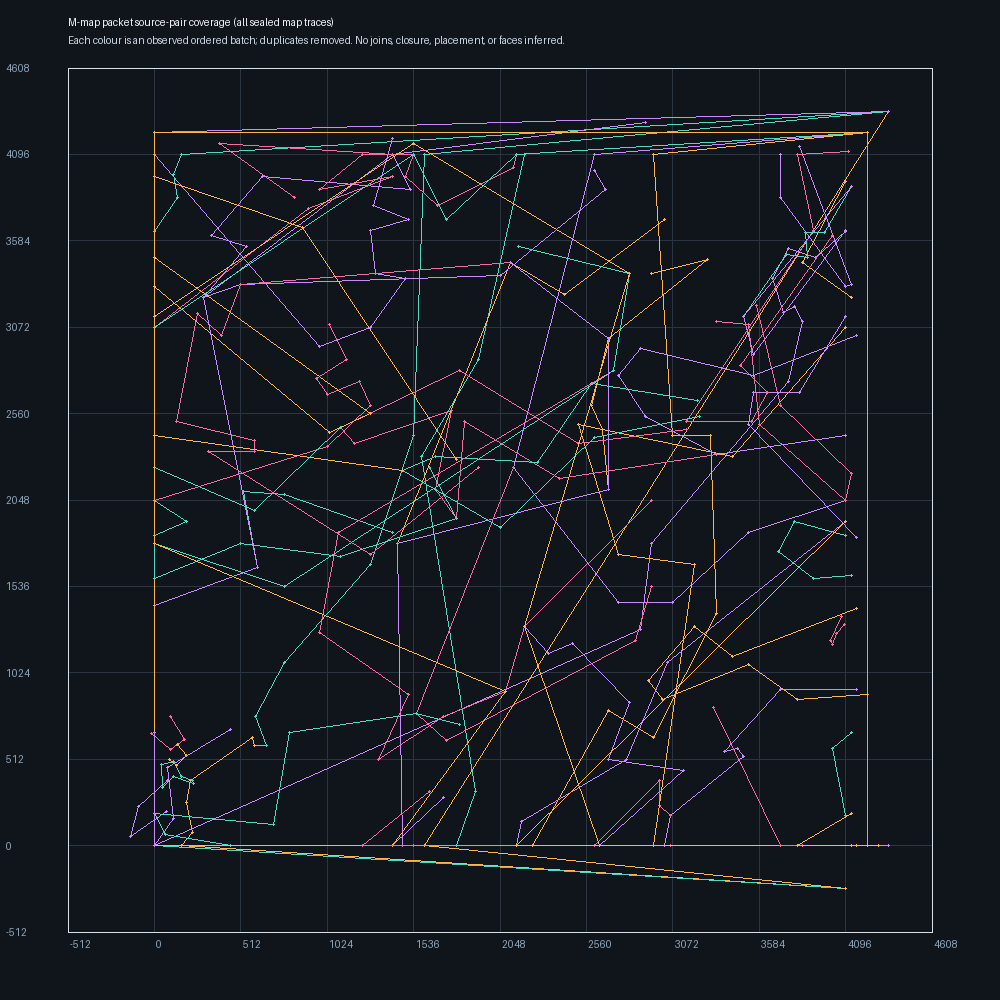

# Cumulative M-map packet source visual

Classification: **bounded renderer-input inspection visual**. It overlays
deduplicated ordered pair paths consumed by the static segment-68 M-map
packet loop across the listed sealed captures. It is not a complete terrain
mesh, a world-coordinate export, or an LOD visualization.

The image contains 59 distinct observed paths and
387 exact immutable pair addresses. This is
24.87% of the 6224
bytes in segment 68 when counted as four-byte pair payloads. Consecutive
points are joined only within the same traced transform batch; no separate
batches are stitched together.

| Inventory | traced batches | unique pair addresses |
| --- | ---: | ---: |
| `analysis\data\run003_m_map_polygon_static_packets.json` | 55 | 333 |
| `analysis\data\run035_m_map_polygon_static_packets.json` | 21 | 73 |
| `analysis\data\run035_m_map_stable_polygon_static_packets.json` | 8 | 37 |
| `analysis\data\run037_m_map_stable_polygon_static_packets.json` | 56 | 343 |

Viewer convention: the image plots each signed source pair directly as `(x, y)`.
The renderer computes its depth component later; this display does not assign
game axes, absolute map position, paths, coast ownership, or unobserved detail.

Authority: the exact pair inventories named above, generated by
`scripts/inventory_map_polygon_static_packets.py`, and the byte-exact
`$C2AF9C/$C2AF9E` pair reader.
