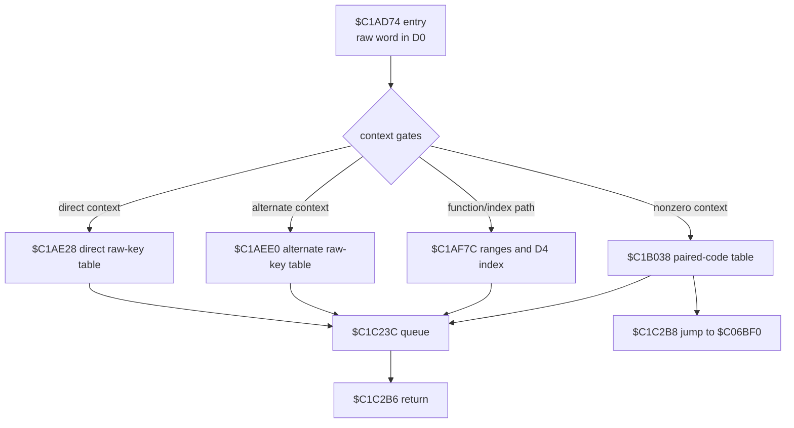

# Keyboard command dispatcher

The contiguous byte-exact source span `$C1AD74-$C1C2BD` receives a raw input
word in `D0`, applies state gates, routes accepted raw key bytes, and normally
ends at the common queue at `$C1C23C`. It is assembled and compared directly
with `captures/baseline_menu/slow.bin` by `scripts/verify_reconstructions.py`.

| Range | Verified role | Dynamic evidence |
| --- | --- | --- |
| `$C1AD74-$C1AE27` | entry and context gates | post-F10 F1/F10 traces enter at `$C1AD74`. |
| `$C1AE28-$C1AEDF` | direct key comparisons | sealed routes establish Return, eject, gear, flare, chaff, ECM, HUD and target examples. |
| `$C1AEE0-$C1AF7B` | alternate-context comparisons | structural; Return has a sealed route. |
| `$C1AF7C-$C1B00F` | raw `$01-$0A`, F1--F10 and eight-key index ranges | exact post-F10 F1/F10 traces prove `$50-$59` reaches the level route. |
| `$C1B010-$C1B125` | fallback and nonzero-context tables | structural branch facts; individual raw-key evidence is incomplete. |
| `$C1B126-$C1C223` | command handlers and state routes | several sealed run002/run003/run004 handlers are documented in their routine notes. |
| `$C1C224-$C1C2BD` | signed-state bridge, raw-event queue, final transfer | queue routine is structurally reconstructed; its translation table remains separately analysed. |

## Evidence rules

The raw-key tables are exhaustive static routing evidence for this captured
runtime image. A route receives a behavioral control name only when a sealed
recording and bounded trace establish it. The verified function-key evidence
comes from the post-F10 saved state: native raw `$50-$59` enters `$C1BD04` and
publishes the observed level byte at `$C45870`.

The table intentionally does not treat every static raw-key comparison as a
working control. Use an isolated no-future-input trace for each new binding,
then add the result to the corresponding routine note and memory-map entry.
For example, a controlled top-level run029 frontend `F` event did not reach
`$C1AD74` or its `$C06BF0` transfer through frame 400; frontend key identity
and the dispatcher's raw `$46` value must remain separate evidence domains.
