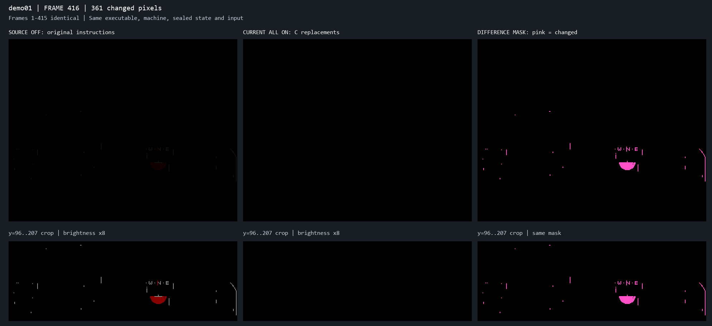

# First visible difference: demo frame 416

2026-10-02, after the gauge correction and with the workspace helper batch
temporarily registered. These are fresh runs of the same native executable,
machine model, sealed demo state and input. Source OFF executes the original
generated instructions; ALL ON uses the registered readable-C replacements
and their available timing bridges. This is not an archived Engine9000 versus
native-machine comparison.



All RGB444 bytes match through one-based frame 415. At 416 the source has
361 nonblack pixels while ALL remains completely black: 168 dim-grey pixels
(111) and 193 dim-red pixels (100) disappear to 000. These include compass
lettering, an instrument shape and cockpit lines. The figure's top panels use
unmodified RGB444 colours, enlarged by nearest neighbour. The lower source
and ALL crops have brightness multiplied by eight, explicitly labelled.
Pink marks changed pixels only. The complete 320x256 frames include the
black margins.

| Frame | Source nonblack pixels | ALL nonblack pixels | Changed pixels |
| --- | ---: | ---: | ---: |
| 414 | 0 | 0 | 0 |
| 415 | 0 | 0 | 0 |
| 416 | 361 | 0 | 361 |
| 417 | 361 | 0 | 361 |
| 418 | 361 | 361 | 0 |
| 419 | 29,453 | 361 | 29,453 |
| 420 | 29,453 | 361 | 29,453 |

ALL frames 418, 419 and 420 are byte-identical to source frame 416. The first
dim cockpit image therefore appears two PAL frames (40 ms) late. The later
reveal is also delayed. The subsequent callback trace below confirms that
the fade's start and terminal mode are shifted by two machine frames. The
gauge's isolated correction did not change these combined frame-416 bytes.
It is not evidence of a universal two-frame offset for the complete replay.

The new frame hashes equal the earlier checkpoint's source and incorrect
ALL hashes:

```text
source: de4e8b22018529118b2a4125b19a5a92b9ae30489a4dbcdf430f720e1d5d2c89
ALL:    6cdd259c8ecbe61fbc369f3293c1961541386954a223b17a37899d7fd9ad42da
```

The 8-connected difference components and nearby-frame checks are preserved
in `analysis/figures/native_frame_416_comparison.json`. The largest component
has 199 pixels at x=198..220, y=171..183; the right cockpit edge has 47 at
x=310..318, y=154..199. Reproduce the bounded comparison with:

```text
python scripts/render_recomp_comparison.py --frame 416 --context-frames 4
```

The tool checks every preceding frame, caps replay output and deletes its two
RGB streams even on failure. Only a small PNG and JSON remain. The separate
source-family work and failing combined checkpoint remain in the handoff.

## Fade callback confirmation

The user's Copper-fade observation led to a bounded trace of the actual
palette owner, $C1718E, and the $C0FA04 scene-transition reset. The source
instructions select the 16-word table at $C08510+(15-mode)*32 and invoke
LoadRGB4 through $C53EC0. The historical independent list-write evidence is
in `run075_frame392_cockpit_entry.md`; its archived frame numbers are not
substituted for the fresh native measurements here.

| Boundary (machine frame counter) | Source OFF | ALL ON |
| --- | ---: | ---: |
| C0FA0E: before scene initialization | 393, line 251 | 394, line 251 |
| C0FA12: after scene initialization | 393, line 287 | 395, line 3 |
| C0FA32: current fade mode reset to 0 | 393, line 287 | 395, line 25 |
| C17322: first increment to mode 1 | 394 | 396 |
| C17322: increment to mode 8 | 415 | 417 |
| C1741A: terminal mode 15, state set to 3 | 436, line 142 | 438, line 142 |

All 15 increments are three machine frames apart on each side. The first
visible output is RGB frame 416/418, after the mode-8 load in machine frame
415/417. The palette callback is already source-timed. Its step rate is
preserved; the fade starts late.

The $C0FA0E-to-$C0FA12 span is 16,280 cycles in source and 32,018 in ALL.
The registered $C0FAA4 scene initializer charges a fixed 32,000 cycles and
crosses vertical blank on this call. The fade reset then follows that blank's
callback rather than preceding it. Another whole machine frame of delay is
already inherited at entry. A control retaining ALL except the $C0FAA4
replacement resets mode 0 in machine frame 394 and reaches terminal mode in
437: restoring the original initializer removes one of the two delayed
frames, while the inherited frame remains. Its first RGB difference remains
416/361, so that bypass is a diagnostic, not a completed parity fix.

Reproduce the normal callback checkpoint with:

```text
python tools/recomp/trace_viewport_fade.py
```

`analysis/figures/native_viewport_fade_checkpoint.json` retains the selected
instruction boundaries, cycles and palette pointers. The script caps and
removes its CSVs. The bypass control is cached under build/recomp/. The next
timing work must preserve the initializer's actual child/event timing and
locate the inherited one-frame transition delay; no frame offset or adjusted
average fee is a source-backed correction.
